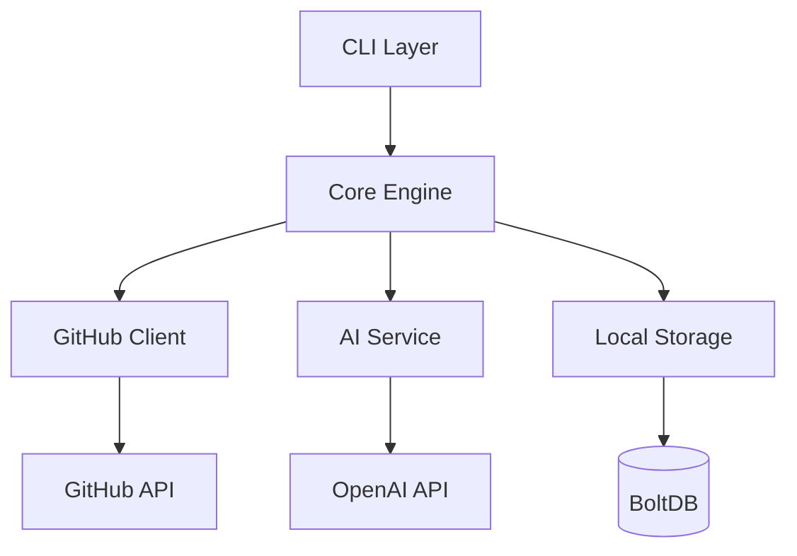

# SET CLI - Software Estimation Tool 🚀

[](https://golang.org)
[]()
[](LICENSE)

> Ferramenta CLI inteligente para estimativa de esforço em tarefas de desenvolvimento de software usando IA e análise de dados históricos.

## 🎯 Sobre o Projeto

O SET CLI foi desenvolvido como parte do TCC em Engenharia de Software da PUC Minas, com o objetivo de resolver um dos maiores desafios no desenvolvimento ágil: **estimativas precisas de esforço**.

### ✨ Funcionalidades Principais

- 🤖 **Estimativas baseadas em IA** - Utiliza GPT-4/Claude para análise inteligente
- 📊 **Análise de dados históricos** - Aprende com projetos anteriores
- 🔗 **Integração GitHub** - Coleta automática de dados de repositórios
- 📈 **Análise de performance** - Identifica padrões e oportunidades de melhoria
- 📋 **Relatórios executivos** - Dashboards para Product Owners e Stakeholders
- ⚡ **Processamento em lote** - Estima múltiplas tarefas simultaneamente

### 🎭 Para quem é destinado

| Persona | Uso Principal |
|---------|---------------|
| 👨‍💻 **Desenvolvedores** | Estimativas individuais, validação de esforço |
| 🎯 **Scrum Masters** | Planning de sprints, análise de equipe |
| 📊 **Product Owners** | Relatórios executivos, planejamento de releases |

## 🚀 Instalação

### Pré-requisitos

- **Go 1.21+** - [Instalar Go](https://golang.org/doc/install)
- **Git** - Para integração com repositórios
- **Token GitHub** - Para acesso aos dados dos repositórios

### Instalação via Go

```bash
go install github.com/seu-usuario/set-cli@latest
```

### Instalação via Download

```bash
# Linux/macOS
curl -L https://github.com/seu-usuario/set-cli/releases/latest/download/set-linux-amd64 -o set
chmod +x set
sudo mv set /usr/local/bin/

# Windows (PowerShell)
Invoke-WebRequest -Uri "https://github.com/seu-usuario/set-cli/releases/latest/download/set-windows-amd64.exe" -OutFile "set.exe"
```

### Desenvolvimento

```bash
git clone https://github.com/seu-usuario/set-cli
cd set-cli
go mod tidy
go build -o set main.go
```

## ⚡ Quick Start

### 1. Configuração inicial

```bash
# Configuração interativa (recomendado)
set configure --initial

# Ou configuração manual
set configure --github-token "ghp_xxxx" --default-repo "facebook/react"
```

### 2. Primeira estimativa

```bash
# Estimar uma tarefa simples
set estimate --task "Implementar sistema de login com OAuth"

# Ver tarefas similares
set estimate --task "Criar API REST" --show-similar
```

### 3. Análise de dados

```bash
# Analisar performance da equipe
set analyze --team backend --period last-3-months

# Gerar relatório executivo
set report --type executive --output pdf
```

## 📖 Uso Detalhado

### Comandos Principais

<details>
<summary><code>set configure</code> - Configuração do sistema</summary>

```bash
# Configuração interativa completa
set configure --initial

# Configurar token GitHub
set configure --github-token "ghp_xxxxxxxxxxxx"

# Definir repositório padrão
set configure --default-repo "facebook/react"

# Ver configurações atuais
set configure list

# Configurar provedor de IA
set configure --ai-provider openai --ai-key "sk-xxxxx"
```
</details>

<details>
<summary><code>set estimate</code> - Estimativas de tarefas</summary>

```bash
# Estimativa individual
set estimate --task "Implementar autenticação OAuth com Google"

# Com parâmetros específicos
set estimate -t "Criar dashboard admin" --show-similar --confidence 80

# Estimativa em lote (futuro)
set estimate --batch backlog.json --output results.csv

# Formatos de saída
set estimate -t "Task" --format json
set estimate -t "Task" --format table  # padrão
```
</details>

<details>
<summary><code>set analyze</code> - Análise de dados históricos</summary>

```bash
# Análise geral da equipe
set analyze --team backend --period last-6-months

# Análise de precisão
set analyze --accuracy --developer "john.doe"

# Identificar padrões
set analyze --patterns --task-type "authentication"

# Comparar períodos
set analyze --compare --baseline "Q1-2024" --current "Q2-2024"
```
</details>

<details>
<summary><code>set report</code> - Relatórios e dashboards</summary>

```bash
# Relatório executivo
set report --type executive --output pdf

# Dashboard de performance
set report --type dashboard --team frontend

# Relatório de accuracy
set report --accuracy --period last-sprint --format csv

# Relatório customizado
set report --template custom.tmpl --data recent.json
```
</details>

### Arquivos de Configuração

O SET CLI usa arquivos YAML para configuração:

```yaml
# ~/.set.yaml
github:
  token: "ghp_xxxxxxxxxxxxxxxxxxxx"
  default_repo: "company/main-project"
  
ai:
  provider: "openai"
  model: "gpt-4"
  
estimation:
  confidence_threshold: 75
  max_similar_tasks: 5
  
output:
  format: "table"
  colors: true
```

## 🏗️ Arquitetura



### Stack Tecnológico

- **Linguagem**: Go 1.21+
- **CLI Framework**: Cobra + Viper
- **Persistência**: BoltDB (embedded)
- **APIs**: GitHub API v4, OpenAI API
- **Testes**: Go testing + Testify
- **Build**: Make + GitHub Actions

## 🧪 Desenvolvimento

### Setup do ambiente

```bash
# Instalar cobra-cli
go install github.com/spf13/cobra-cli@latest

# Clonar e configurar
git clone https://github.com/seu-usuario/set-cli
cd set-cli
go mod tidy

# Executar em modo dev
go run main.go --help
```

### Comandos de desenvolvimento

```bash
# Executar testes
go test ./...

# Testes com cobertura
go test -coverprofile=coverage.out ./...
go tool cover -html=coverage.out

# Build para múltiplas plataformas
GOOS=linux GOARCH=amd64 go build -o bin/set-linux-amd64 main.go
GOOS=darwin GOARCH=amd64 go build -o bin/set-darwin-amd64 main.go
GOOS=windows GOARCH=amd64 go build -o bin/set-windows-amd64.exe main.go

# Linting (requer golangci-lint)
golangci-lint run
```

### Adicionando novos comandos

```bash
# Adicionar novo comando
cobra-cli add newcommand

# Adicionar subcomando
cobra-cli add subcommand -p 'parentCmd'
```

## 🗺️ Roadmap

### ✅ Sprint 1 (Concluída) - Setup e CLI Básica
- [x] Estrutura base com Cobra CLI
- [x] Sistema de configuração com Viper
- [x] Comandos básicos

### 🚧 Sprint 2 (Em andamento) - Integração GitHub
- [ ] Cliente GitHub API
- [ ] Coleta de dados históricos
- [ ] Sistema de cache local

### 📋 Próximas Sprints
- [ ] **Sprint 3**: Core de estimativas + IA
- [ ] **Sprint 4**: Análise avançada + relatórios
- [ ] **Sprint 5**: Funcionalidades premium
- [ ] **Sprint 6**: Otimizações + deployment

## 🤝 Contribuição

Contribuições são bem-vindas! Por favor:

1. **Fork** o projeto
2. Crie uma **branch** para sua feature (`git checkout -b feature/amazing-feature`)
3. **Commit** suas mudanças (`git commit -m 'Add amazing feature'`)
4. **Push** para a branch (`git push origin feature/amazing-feature`)
5. Abra um **Pull Request**

### Guidelines

- Siga as convenções do Go (gofmt, golint)
- Adicione testes para novas funcionalidades
- Atualize documentação quando necessário
- Use [Conventional Commits](https://conventionalcommits.org/)

## 📄 Licença

Este projeto está licenciado sob a MIT License - veja [LICENSE](LICENSE) para detalhes.

## 👥 Equipe

- **Inácio Moraes da Silva** - *Desenvolvedor Principal* - [GitHub](https://github.com/seu-usuario)
- **Prof. Cleiton Silva Tavares** - *Orientador* - PUC Minas

## 🙏 Agradecimentos

- PUC Minas - Curso de Engenharia de Software
- Comunidade Go pela excelente documentação
- OpenAI pelos serviços de IA
- GitHub pela API robusta
