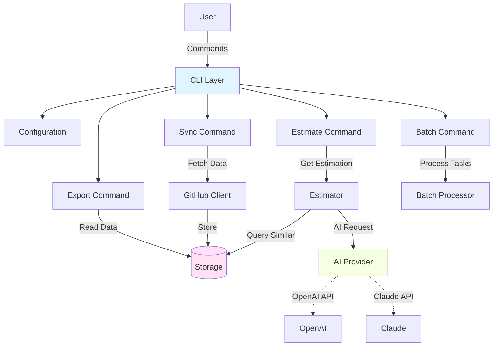
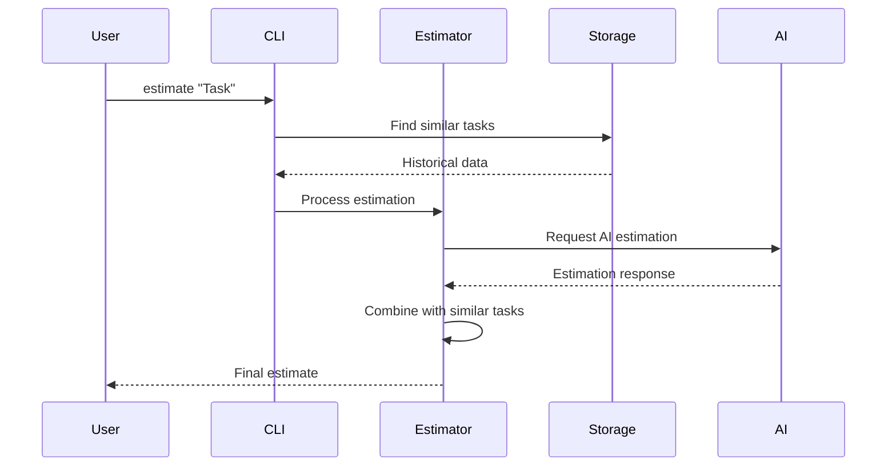
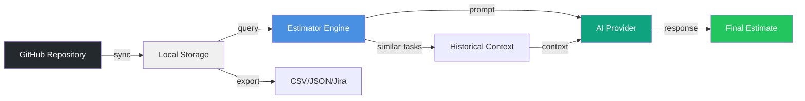

# SET CLI - Software Estimation Tool

[](https://golang.org)
[]()
[](LICENSE)
[]()

> AI-powered CLI tool for software task estimation using historical data and intelligent analysis.

## About

SET CLI is a TCC project for Software Engineering at PUC Minas, designed to solve one of agile development's biggest challenges: **accurate effort estimation**.

### Key Features

- 🤖 **AI-Powered Estimates** - OpenAI integration for intelligent analysis
- 📊 **Historical Analysis** - Learn from past project data
- 🔗 **GitHub Integration** - Automatic data collection from repositories
- ⚡ **Batch Processing** - Estimate multiple tasks simultaneously
- 📤 **Data Export** - Multiple formats (CSV, JSON, Markdown, Excel, Jira)
- 🔍 **Inspection Tools** - Analyze stored data and statistics

## Quick Start

### Installation

```bash
# Build from source
git clone <repository-url>
cd set-cli
go build -o set main.go

# Or install directly
go install <module-path>@latest
```

### Basic Usage

```bash
# 1. Configure GitHub and AI credentials
set configure --initial

# 2. Sync repository data
set sync

# 3. Estimate a single task
set estimate "Implement OAuth login system"

# 4. Batch estimate from file
set batch --file tasks.json
```

## Architecture



## Command Reference

### `configure` - Setup credentials and preferences

```bash
# Interactive setup
set configure --initial

# Configure GitHub token
set configure --github-token "ghp_xxxxx"

# Configure AI provider
set configure --ai-provider openai --ai-key "sk-xxxxx"

# Set default repository
set configure --default-repo "owner/repo"

# List current configuration
set configure list
```

### `sync` - Fetch data from GitHub

```bash
# Sync default repository
set sync

# Sync specific repository
set sync --repo owner/repository

# Full sync (issues + pull requests)
set sync --full
```

### `estimate` - Estimate single task

```bash
# Simple estimation
set estimate "Create REST API for users"

# With description and similar tasks
set estimate "Add authentication" \
  --description "OAuth 2.0 with Google and GitHub" \
  --show-similar

# Different output formats
set estimate "Task" --output json
set estimate "Task" --output table
```

**Estimation Flow:**



### `batch` - Process multiple tasks

```bash
# From JSON file
set batch --file tasks.json --output results.json

# From CSV file
set batch --file backlog.csv --format csv

# With custom workers
set batch --file tasks.json --workers 5

# Different output formats
set batch --file tasks.json --output report.md --format markdown
set batch --file tasks.csv --output estimates.csv --format csv
```

**Input Format (JSON):**
```json
{
  "tasks": [
    {
      "title": "Implement user authentication",
      "description": "OAuth 2.0 integration",
      "labels": ["backend", "security"]
    },
    {
      "title": "Create admin dashboard",
      "labels": ["frontend", "ui"]
    }
  ]
}
```

**Input Format (CSV):**
```csv
Title,Description,Labels
Implement user auth,OAuth 2.0,"backend,security"
Create dashboard,Analytics panel,"frontend,ui"
```

### `export` - Export historical data

```bash
# Export to CSV
set export --format csv --output data.csv

# Export to JSON
set export --format json --output data.json

# Export for Jira import
set export --format jira --output jira-import.csv

# Export to Markdown report
set export --format markdown --output report.md

# Filter exports
set export --filter bug --output bugs.csv
set export --date-from 2025-01-01 --output recent.csv
```

### `inspect` - Analyze stored data

```bash
# View database statistics
set inspect

# Detailed inspection
set inspect --verbose

# Export inspection report
set inspect --output report.txt
```

### `dev` - Development utilities

```bash
# Seed test data
set dev seed

# Clear all data
set dev clear

# Check dev mode status
set dev
```

## Data Flow



## Configuration

SET CLI uses `~/.set.yaml` for configuration:

```yaml
github:
  token: "ghp_xxxxxxxxxxxxxxxxxxxx"
  default_repo: "owner/repository"

ai:
  provider: "openai"        # or "claude"
  api_key: "sk-xxxxx"
  model: "gpt-4"            # optional

estimation:
  confidence_threshold: 0.75
  max_similar_tasks: 5

output:
  format: "table"          # table, json, csv
  colors: true
```

## Tech Stack

- **Language**: Go 1.21+
- **CLI Framework**: [Cobra](https://github.com/spf13/cobra) + [Viper](https://github.com/spf13/viper)
- **Database**: [BoltDB](https://github.com/etcd-io/bbolt) (embedded key-value store)
- **APIs**: GitHub REST API v3, OpenAI/Claude APIs
- **Testing**: Go testing + [Testify](https://github.com/stretchr/testify)
- **Logging**: Custom structured logger

## Development

### Setup

```bash
# Clone repository
git clone <repository-url>
cd set-cli

# Install dependencies
go mod tidy

# Run in development mode
go run main.go --help
```

### Testing

```bash
# Run all tests
go test ./...

# Run with coverage
go test -coverprofile=coverage.out ./...
go tool cover -html=coverage.out

# Run specific package tests
go test ./internal/estimator/...
go test ./internal/github/...
```

### Build

```bash
# Build for current platform
go build -o set main.go

# Cross-platform builds
GOOS=linux GOARCH=amd64 go build -o bin/set-linux-amd64
GOOS=darwin GOARCH=amd64 go build -o bin/set-darwin-amd64
GOOS=windows GOARCH=amd64 go build -o bin/set-windows.exe
```

### Project Structure

```
.
├── cmd/                    # CLI commands
│   ├── root.go            # Root command & setup
│   ├── configure.go       # Configuration management
│   ├── sync.go            # GitHub synchronization
│   ├── estimate.go        # Single task estimation
│   ├── batch.go           # Batch processing
│   ├── export.go          # Data export
│   ├── inspect.go         # Database inspection
│   └── dev.go             # Development utilities
├── internal/              # Internal packages
│   ├── ai/               # AI provider integration
│   ├── config/           # Configuration management
│   ├── estimator/        # Estimation engine
│   ├── github/           # GitHub API client
│   ├── logger/           # Structured logging
│   └── storage/          # Data persistence
├── main.go               # Application entry point
└── go.mod                # Go module definition
```

## Contributing

Contributions are welcome! Please:

1. Fork the repository
2. Create a feature branch (`git checkout -b feature/amazing-feature`)
3. Commit your changes (use [Conventional Commits](https://conventionalcommits.org/))
4. Push to the branch
5. Open a Pull Request

### Guidelines

- Follow Go conventions (`gofmt`, `golint`)
- Add tests for new functionality (target: 65%+ coverage)
- Update documentation for user-facing changes
- Keep commits atomic and well-described

## License

This project is licensed under the MIT License - see [LICENSE](LICENSE) for details.

## Team

- **Inácio Moraes da Silva** - *Lead Developer*
- **Prof. Cleiton Silva Tavares** - *Advisor* - PUC Minas

## Acknowledgments

- PUC Minas - Software Engineering Program
- Go community for excellent documentation and tools
- OpenAI and Anthropic for AI services
- GitHub for robust API access
