# How Estimation Works - Simple Guide

This guide explains how SET CLI estimates software tasks in plain language.

---

## The Big Picture

SET CLI estimates how long a task will take by:

1. **Finding similar past tasks** in your project history
2. **Collecting team statistics** from your completed work
3. **Sending everything to AI (GPT-4)** which analyzes it all and produces the estimate


---

## Step-by-Step Process

### Step 1: You Submit a Task

```bash
set estimate "Add dark mode toggle"
```

SET CLI receives:
- **Title**: "Add dark mode toggle"
- **Description** (optional): More details about the task
- **Labels** (optional): Tags like "frontend", "ui"

### Step 2: Search for Similar Tasks

SET CLI looks through your project's history to find similar work:


**Example Match:**
```
New Task: "Add dark mode toggle"
Found:    "Implement theme switcher" (85% similar)
          Took 6 hours, Size: M
```

#### How Similarity Works

SET CLI compares tasks using four factors:

1. **Title Matching (40% weight)**
   - Compares words and phrases in the title
   - "dark mode" matches "theme switcher"
   - "authentication" matches "login system"

2. **Description Matching (30% weight)**
   - Analyzes similarity in task descriptions
   - Detailed descriptions improve matching accuracy

3. **Label Matching (20% weight)**
   - Compares tags like "frontend", "backend"
   - More matching labels = higher score

4. **Context Matching (10% weight)**
   - Compares story points, priority, etc.
   - Uses GitHub Projects custom fields

**Final Score**: Weighted sum = 0.0 to 1.0 (0% to 100%)

#### Adaptive Threshold Search

SET CLI uses smart threshold adjustment to find the best matches:

1. **First try**: Look for tasks >50% similar (very similar)
2. **If not enough found**: Lower to >40% (quite similar)
3. **Then**: Try >30% (moderately similar)
4. **Then**: Try >20% (somewhat similar)
5. **Finally**: Try >15% (loosely similar)

This ensures you get the most relevant matches available, even for unique tasks.

The system also uses **enhanced dataset selection**:
- Takes similar tasks found above threshold
- Adds stratified samples from each size category (XS, S, M, L, XL)
- Adds tasks from different percentiles (25th, 50th, 75th, 90th)
- Ensures AI sees diverse examples (minimum 10 tasks if available)

### Step 3: Ask AI to Analyze

SET CLI sends the task to GPT-4 with rich context:


**What AI Receives:**

```
Task: Add dark mode toggle
Description: Theme switcher with user preference storage

Similar Past Tasks:
1. "Implement theme switcher" (85% similar)
   - Took 6 hours
   - Size: M
   - Labels: frontend, ui

2. "Add color customization" (72% similar)
   - Took 4 hours
   - Size: S

Team Stats:
- Average frontend task: 5.5 hours
- UI tasks average: 4.8 hours
- Total tasks completed: 127
```

**AI Analysis:**

The AI considers:
- ✓ Technical complexity
- ✓ Similar past work
- ✓ Your team's patterns
- ✓ Potential risks
- ✓ Common pitfalls

#### The Actual AI Prompt

SET CLI uses a structured prompt to ensure accurate estimates. Here's what gets sent to GPT-4:

**System Message (defines AI's role):**
```
You are an expert software estimation assistant. Your role is to provide
accurate time and effort estimates for software development tasks.

You should:
1. Analyze the task description carefully
2. Consider similar historical tasks if provided
3. Factor in complexity, risks, and dependencies
4. Provide estimates in multiple formats (hours, story points, size)
5. Explain your reasoning clearly
6. Highlight key assumptions and potential risks
7. Be realistic and slightly conservative in estimates
```

**User Message Structure:**

The prompt is built dynamically with these sections:

1. **Task Information**
   - Title and description
   - Additional context (priority, labels, custom fields)

2. **Historical Dataset Overview**
   - Total tasks (e.g., 127 tasks, 108 completed)
   - Average/median duration (e.g., 6.2h avg, 5.0h median)
   - Effort percentiles (10th, 25th, 50th, 75th, 90th)
   - Size distribution (XS, S, M, L, XL counts)

3. **Category Breakdown**
   - Effort patterns by category (frontend, backend, etc.)
   - Average hours, range, and example tasks per category

4. **Reference Tasks (Enhanced Dataset)**
   - Similar tasks ordered by relevance (with % match)
   - Stratified samples from each size category
   - Percentile samples for effort diversity
   - For each task shows:
     - Title, description, actual hours
     - Size, story points, labels

5. **Instructions**
   - Provide realistic estimates in JSON format
   - Include reasoning, assumptions, and risks

**Expected AI Response Format:**
```json
{
  "estimated_hours": 7.0,
  "estimated_size": "M",
  "story_points": 5,
  "confidence_score": 0.82,
  "reasoning": "Similar to theme switcher. Requires CSS variables, localStorage, system detection. Medium complexity.",
  "assumptions": [
    "Using CSS variables",
    "localStorage for persistence",
    "Standard implementation"
  ],
  "risks": [
    "Browser compatibility testing (+1-2h)",
    "Design review may require changes"
  ],
  "recommended_action": "Consider accessibility features"
}
```

The AI must respond with valid JSON including:
- `estimated_hours` (number)
- `estimated_size` (XS/S/M/L/XL)
- `story_points` (Fibonacci: 1, 2, 3, 5, 8, 13, 21)
- `confidence_score` (0.0-1.0)
- `reasoning` (explanation)
- `assumptions` (array)
- `risks` (array)
- `recommended_action` (optional)

### Step 4: AI Generates Final Estimate

The AI analyzes everything and produces the final estimate:


**How AI Decides:**

The AI considers all the context provided:
- Your task title and description
- Similar tasks that were found (with their actual hours)
- Overall team statistics (average hours, median, percentiles)
- Task distribution by size and category
- How similar the matches are

The AI then generates:
- **Estimated Hours**: Based on similar work and complexity
- **Size Category**: XS, S, M, L, or XL
- **Story Points**: Fibonacci scale (1, 2, 3, 5, 8, 13)
- **Confidence Score**: 0-100% based on data quality
- **Reasoning**: Why this estimate makes sense
- **Assumptions**: What the AI assumed
- **Risks**: What could increase the estimate

### Step 5: Display Results

```
╔═══════════════════════════════════════════════════╗
║ 📊 ESTIMATION RESULTS                             ║
╠═══════════════════════════════════════════════════╣
║                                                   ║
║ Task: Add dark mode toggle                       ║
║                                                   ║
║ ⏱️  Time:        7 hours                          ║
║ 📏 Size:        M (Medium)                        ║
║ 🎯 Points:      5                                 ║
║ 💯 Confidence:  82% (High)                        ║
║                                                   ║
╠═══════════════════════════════════════════════════╣
║ 💡 Why this estimate?                             ║
╠═══════════════════════════════════════════════════╣
║                                                   ║
║ Similar to "theme switcher" (6h). Needs CSS      ║
║ variables, local storage, and system detection.  ║
║ Medium complexity with well-known patterns.       ║
║                                                   ║
╠═══════════════════════════════════════════════════╣
║ 📋 What we're assuming:                           ║
╠═══════════════════════════════════════════════════╣
║                                                   ║
║ • Using CSS variables                             ║
║ • localStorage for persistence                    ║
║ • Standard implementation                         ║
║                                                   ║
╠═══════════════════════════════════════════════════╣
║ ⚠️  Potential risks:                              ║
╠═══════════════════════════════════════════════════╣
║                                                   ║
║ • Browser compatibility testing (+1-2h)           ║
║ • Design review may need changes                  ║
║                                                   ║
╠═══════════════════════════════════════════════════╣
║ 🔍 Similar tasks we found:                        ║
╠═══════════════════════════════════════════════════╣
║                                                   ║
║ 1. Implement theme switcher (85% match)          ║
║    ⏱️  6h │ M │ frontend, ui                      ║
║                                                   ║
║ 2. Add color customization (72% match)           ║
║    ⏱️  4h │ S │ frontend, settings                ║
║                                                   ║
╚═══════════════════════════════════════════════════╝
```

---

## Understanding the Output

### Time Estimate

The hours needed to complete the task:
- **Range**: 0.5 to 40+ hours
- **Includes**: Development + basic testing
- **Excludes**: Code review, deployment, meetings

### Size Categories

| Size | Hours | Story Points | Description |
|------|-------|--------------|-------------|
| **XS** | 0.5-2h | 1-2 | Quick fix or tiny feature |
| **S** | 2-4h | 2-3 | Small feature or bug fix |
| **M** | 4-8h | 5 | Standard feature |
| **L** | 8-16h | 8 | Large feature |
| **XL** | 16-40h | 13 | Very large, consider splitting |

### Confidence Score

How reliable the estimate is:

```mermaid
graph LR
    A[Confidence] --> B{Score}
    B -->|\>80%| C[High<br/>✅ Reliable]
    B -->|60-80%| D[Medium<br/>⚠️ Good]
    B -->|<60%| E[Low<br/>❌ Uncertain]

    C --> F[Use as-is]
    D --> G[Add 10-20% buffer]
    E --> H[Add 30%+ buffer]

    style C fill:#e1ffe1
    style D fill:#fff5e1
    style E fill:#ffe1e1
```



**What affects confidence:**

**Higher Confidence:**
- ✅ Found very similar past tasks (>80%)
- ✅ Large historical dataset (50+ tasks)
- ✅ Clear, detailed task description
- ✅ Common task type for your team

**Lower Confidence:**
- ❌ No similar tasks found
- ❌ Small dataset (<10 tasks)
- ❌ Vague task description
- ❌ Novel/unprecedented task

---

## Batch Processing

Estimate many tasks at once:

```bash
set batch --file sprint-tasks.json
```


**Features:**
- Processes 3 tasks in parallel (configurable)
- Shows progress bar
- Generates summary statistics
- Exports to CSV, JSON, or Markdown

---

## How It Gets Better Over Time

As you complete tasks, SET CLI builds a better knowledge base for the AI:


**Data Growth Process:**

1. **First week**: AI works with minimal history (good baseline)
2. **After 10 tasks**: AI sees emerging patterns in your work (better)
3. **After 50 tasks**: AI has strong reference points (very good)
4. **After 100+ tasks**: AI has comprehensive context (excellent)

The AI itself doesn't learn - but more historical data means better context for each estimate.

---

## Real Examples

### Example 1: Backend API

**Input:**
```bash
set estimate "Create REST API for user profiles"
```

**What happens:**
1. Finds: "Create product API" (78% similar, 5h)
2. Finds: "Build order API" (72% similar, 6h)
3. AI analyzes: Typical CRUD, moderate complexity
4. **Result**: 5.5 hours, Size M, Confidence 85%

### Example 2: Bug Fix

**Input:**
```bash
set estimate "Fix memory leak in cache system" \
  --description "Redis connections not closing properly"
```

**What happens:**
1. Finds: "Fix database connection leak" (91% similar, 3h)
2. AI considers: Infrastructure debugging, needs testing
3. **Result**: 3 hours, Size S, Confidence 88%

### Example 3: New Technology

**Input:**
```bash
set estimate "Implement WebSocket real-time updates"
```

**What happens:**
1. No similar tasks found (new tech for team)
2. AI analyzes: Complex, unfamiliar technology
3. **Result**: 12 hours, Size L, Confidence 58% (LOW)

**Action**: Add 30% buffer → 15-16 hours

---

## Tips for Better Estimates

### 1. Write Clear Descriptions

**❌ Vague:**
```bash
set estimate "Fix bug"
```

**✅ Specific:**
```bash
set estimate "Fix login redirect bug" \
  --description "Users stuck in loop after OAuth, need to debug callback"
```

### 2. Use Consistent Labels

Help SET CLI find patterns:

**Good labels:**
- `frontend`, `backend`, `database`
- `bug`, `feature`, `refactor`
- `urgent`, `normal`, `low`

**Avoid:**
- Mixing styles: "back-end" vs "backend"
- Too specific: "bug-in-login-on-tuesday"

### 3. Sync Regularly

```bash
# Keep data fresh (weekly)
set sync --full
```

Fresh data = better estimates!

### 4. Review AI Reasoning

Always read the "Why this estimate?" section:
- Check assumptions
- Verify similar tasks are actually similar
- Look for red flags in risks

### 5. Add Buffers

General rule:
- High confidence: Use estimate as-is
- Medium confidence: Add 10-20%
- Low confidence: Add 30-50%
- Completely new: Add 50-100%

---

## Common Questions

### "Why is confidence low?"

Usually means:
- No similar tasks in history
- Small dataset (<10 tasks)
- Novel task for your team
- Vague description

**Fix**: Add more details, sync more data, or add a safety buffer.

### "The estimate seems off"

Possible reasons:
- Task is unusual for your team
- Missing context in description
- Historical data doesn't match current team

**Fix**: Review reasoning, check similar tasks, adjust manually.

### "Can I use it without historical data?"

Yes! The tool works without historical data:
- **AI is always required** - SET CLI needs OpenAI to function
- Without history, AI gets less context
- Estimates will have lower confidence
- No comparison to your team's past work

To improve estimates, sync historical data:
```bash
set sync --full
```

### "How accurate is it?"
**Need to do more benchmark**
Depends on:
- **With good history**: 70-85% accurate
- **AI-only**: 60-75% accurate
- **Novel tasks**: 50-60% accurate

*Accuracy improves over time as dataset grows!*

---

## Troubleshooting

### Problem: "No similar tasks found"

**Solutions:**
1. Sync GitHub data: `set sync --full`
2. Check if repository is configured
3. Try anyway - AI-only still works!

### Problem: "AI rate limit exceeded"

**Cause**: Too many requests to OpenAI

**Solutions:**
1. Wait 60 seconds
2. Upgrade OpenAI tier
3. Reduce batch workers: `--workers 1`

### Problem: "Low confidence on all tasks"

**Causes:**
- New project (no history yet)
- Small dataset
- Tasks are all unique

**Solutions:**
- Complete 10-20 tasks first
- Add detailed descriptions
- Accept lower confidence initially
- Builds up over time!

---

## Technical Deep Dive: Similarity Algorithm

This section explains the technical implementation of the similarity calculation and task matching algorithms.

### Similarity Score Calculation

The similarity between two tasks is calculated using a **weighted multi-factor approach**:

```
Total Similarity = (Title × 0.4) + (Description × 0.3) + (Labels × 0.2) + (Context × 0.1)
```

#### 1. Title Similarity (40% weight)

**Algorithm**: TF-IDF (Term Frequency-Inverse Document Frequency) with cosine similarity

**Process**:
1. **Tokenization**: Split title into words, convert to lowercase
2. **Stop word removal**: Remove common words (the, a, an, is, etc.)
3. **TF-IDF vectorization**:
   - Calculate term frequency in each title
   - Calculate inverse document frequency across all tasks
   - Weight rare terms higher than common terms
4. **Cosine similarity**:
   ```
   similarity = (A · B) / (||A|| × ||B||)
   ```
   Where A and B are TF-IDF vectors

**Example**:
```
Task A: "Add dark mode toggle"
Task B: "Implement theme switcher"

Common concepts: theme/mode switching
TF-IDF identifies: "dark", "mode", "toggle" vs "theme", "switcher"
Semantic overlap detected → 0.75 similarity
```

**Why 40% weight**: Title is the strongest signal of task similarity. Most developers write descriptive titles that capture the essence of the work.

#### 2. Description Similarity (30% weight)

**Algorithm**: Same TF-IDF + cosine similarity as title

**Process**:
1. Tokenize full description text
2. Remove stop words
3. Calculate TF-IDF vectors (considers entire corpus)
4. Compute cosine similarity

**Special handling**:
- Empty descriptions get 0.0 score (doesn't penalize tasks without descriptions)
- Weighted average adjusts if one task lacks description
- Longer descriptions provide better matching signal

**Example**:
```
Task A description: "Implement theme switcher with localStorage persistence"
Task B description: "Add color theme toggle saved to browser storage"

Overlap: theme, toggle, storage/localStorage (synonyms detected)
Result: 0.82 similarity
```

**Why 30% weight**: Description provides rich context but not all tasks have detailed descriptions. Weight balances usefulness vs. availability.

#### 3. Label Similarity (20% weight)

**Algorithm**: Jaccard Index (set intersection over union)

**Formula**:
```
Jaccard(A, B) = |A ∩ B| / |A ∪ B|
```

**Process**:
1. Convert labels to sets: `{frontend, ui, css}` vs `{frontend, styling, ui}`
2. Calculate intersection: `{frontend, ui}` → 2 common labels
3. Calculate union: `{frontend, ui, css, styling}` → 4 total unique labels
4. Divide: 2/4 = 0.5

**Example**:
```
Task A labels: [frontend, ui, react]
Task B labels: [frontend, ui, vue]

Intersection: {frontend, ui} = 2
Union: {frontend, ui, react, vue} = 4
Jaccard: 2/4 = 0.50
```

**Why 20% weight**: Labels are explicit categorizations but limited in vocabulary. Provides strong signal when available but less nuanced than text.

#### 4. Context Similarity (10% weight)

**Algorithm**: Field-by-field numerical comparison with normalization

**Fields compared**:
- Story points (if available)
- Priority (high=3, medium=2, low=1)
- Complexity estimates
- Custom GitHub Project fields

**Process**:
1. For each numeric field:
   ```
   similarity = 1 - |value_A - value_B| / max_possible_difference
   ```
2. Average across all available fields
3. Missing fields don't penalize (use available fields only)

**Example**:
```
Task A: Story Points = 5, Priority = High (3)
Task B: Story Points = 5, Priority = Medium (2)

Story Points: 1 - |5-5|/13 = 1.0  (perfect match)
Priority: 1 - |3-2|/3 = 0.67
Average: (1.0 + 0.67) / 2 = 0.835
```

**Why 10% weight**: Context fields are useful indicators but often missing or unreliable. Low weight prevents over-reliance on incomplete data.

### Adaptive Threshold Search

The system uses **progressive threshold reduction** to find optimal matches:

```go
thresholds := []float64{
    0.5,  // 50% - Very similar (strict)
    0.4,  // 40% - Quite similar
    0.3,  // 30% - Moderately similar (default)
    0.2,  // 20% - Somewhat similar
    0.15, // 15% - Loosely similar (lenient)
}
```

**Algorithm**:
```
for each threshold in thresholds:
    matches = find_tasks_above_threshold(threshold)
    if len(matches) >= min_required_tasks:
        return matches
return all_matches_found  // even if below minimum
```

**Configuration**:
- `MinSimilarTasks`: Minimum matches needed (default: 10)
- `MaxSimilarTasks`: Maximum to return (default: 15)

**Why adaptive**: Ensures relevant matches for both common and unique tasks. Strict thresholds for typical work, lenient for novel tasks.

### Enhanced Dataset Selection

Beyond similar tasks, the system adds **diversity samples** to improve AI context:

#### Stratified Sampling

**Goal**: Include examples from each size category

**Algorithm**:
```
for each size in [XS, S, M, L, XL]:
    category_tasks = filter_by_size(historical, size)
    if category_tasks not empty:
        sample = random_select(category_tasks, samples_per_size)
        enhanced_dataset.add(sample)
```

**Configuration**:
- `StratifiedSamplesPerSize`: 2-3 tasks per category
- Ensures AI sees full spectrum of task sizes

**Example**:
```
Historical: 100 tasks
- XS: 15 tasks → sample 2
- S: 30 tasks → sample 2
- M: 35 tasks → sample 2
- L: 15 tasks → sample 2
- XL: 5 tasks → sample 2

Total stratified samples: 10 tasks
```

#### Percentile Sampling

**Goal**: Include tasks at different effort levels

**Algorithm**:
```
effort_values = extract_hours(historical)
percentiles = [25th, 50th, 75th, 90th]

for each percentile:
    target_hours = calculate_percentile(effort_values, percentile)
    closest_task = find_closest_to(historical, target_hours)
    enhanced_dataset.add(closest_task)
```

**Example**:
```
Effort distribution: 0.5h to 40h
- 25th percentile: 3h → find task closest to 3h
- 50th percentile: 5h → find task closest to 5h
- 75th percentile: 8.5h → find task closest to 8.5h
- 90th percentile: 14h → find task closest to 14h
```

**Why percentiles**: Provides reference points across effort spectrum, helps AI calibrate estimates.

### Final Dataset Composition

The enhanced dataset sent to AI includes:

1. **Similar Tasks** (up to 15): Tasks above adaptive threshold, ordered by similarity
2. **Stratified Samples** (up to 10): 2-3 from each size category
3. **Percentile Samples** (4): Tasks at 25th, 50th, 75th, 90th percentiles

**Deduplication**: Tasks appearing in multiple categories are included once

**Minimum**: At least 10 total tasks (if available in history)

**Ordering**: Similar tasks first (most relevant), then samples (diversity)

### Performance Characteristics

**Time Complexity**:
- Similarity calculation: O(n × m) where n = historical tasks, m = avg tokens
- TF-IDF vectorization: O(n × m)
- Adaptive search: O(n × log(n)) for sorting
- Overall: O(n × m) - linear in dataset size

**Space Complexity**:
- TF-IDF vectors: O(n × v) where v = vocabulary size
- Similarity scores: O(n)
- Overall: O(n × v)

**Optimizations**:
- Early termination when threshold met
- Incremental TF-IDF updates (not full rebuild)
- Caching of calculated similarities
- Parallel processing for batch operations

### Accuracy Metrics

Based on internal testing (note: benchmarks needed):

| Similarity Range | Actual Match Rate | Description |
|------------------|-------------------|-------------|
| 90-100% | 95% accurate | Nearly identical tasks |
| 80-89% | 85% accurate | Very similar work |
| 70-79% | 75% accurate | Similar domain/complexity |
| 60-69% | 65% accurate | Related but different |
| 50-59% | 55% accurate | Loosely related |
| <50% | Variable | May not be relevant |

**Match Rate**: Percentage of tasks where similar task's actual hours were within ±30% of new task's actual hours.

### Configuration Reference

Default values in `EstimationConfig`:

```go
type EstimationConfig struct {
    MaxSimilarTasks          int     // 15
    MinSimilarTasks          int     // 10
    MinSimilarityThreshold   float64 // 0.3
    StratifiedSamplesPerSize int     // 2
    UseEnhancedDataset       bool    // true
}
```

### Implementation Files

- `internal/estimator/similarity.go`: Core similarity algorithms
- `internal/estimator/estimator.go`: Adaptive search and dataset selection
- `internal/ai/prompts.go`: Prompt construction with similar tasks

---

**Last Updated:** 2025-10-19
**For:** Technical users and contributors
**Goal:** Understand similarity algorithm implementation
